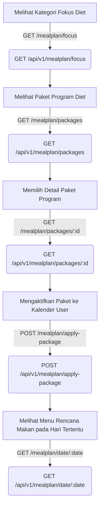

# Frontend API Integration Guide — HealthPlate

Panduan ini membantu developer frontend HealthPlate untuk mengintegrasikan antarmuka aplikasi dengan backend API secara teratur, efisien, dan tanpa kerancuan.

---

## 1. Halaman Login
* **Tujuan**: Autentikasi pengguna masuk ke aplikasi.
* **API Endpoint**: `POST /api/v1/auth/login`
* **Langkah Integrasi**:
  1. Ambil input `email` dan `password` dari form.
  2. Kirim request payload JSON.
  3. Dapatkan token dari path respons `data.session.access_token`.
  4. Simpan token di local secure storage (misalnya Shared Preferences di Flutter atau Keychain di iOS).
  5. Sematkan token tersebut sebagai `Authorization: Bearer <token>` pada Request Header untuk semua panggilan API terproteksi selanjutnya.

---

## 2. Halaman Register
* **Tujuan**: Mendaftarkan akun pengguna baru.
* **API Endpoint**: `POST /api/v1/auth/register`
* **Langkah Integrasi**:
  1. Ambil input `name`, `email`, dan `password`.
  2. Kirim request payload.
  3. Arahkan pengguna ke halaman login jika status respons sukses (`201 Created`).

---

## 3. Halaman Home Dashboard
* **Tujuan**: Menampilkan statistik ringkasan gizi harian, progress air minum, dan daftar makanan yang telah dicatat hari ini.
* **API Endpoints**:
  1. **Asupan & Target Gizi**: `GET /api/v1/dashboard/summary` (Mengambil persentase, total dikonsumsi, target gizi, dan list entri makan hari ini).
  2. **Notifikasi Terbaru**: `GET /api/v1/notification?page=1&limit=3` (Menampilkan sekilas pesan notifikasi belum dibaca di header dashboard).
  3. **Tips Gizi Hari Ini**: `GET /api/v1/tips` (Menampilkan banner tips kesehatan harian secara acak).

---

## 4. Halaman Nutrition Dashboard
* **Tujuan**: Menyajikan visualisasi grafik perkembangan asupan gizi mingguan.
* **API Endpoints**:
  1. **Ringkasan Detail**: `GET /api/v1/dashboard/summary` (Menampilkan sisa target kalori dan makronutrisi harian).
  2. **Data Grafik Mingguan**: `GET /api/v1/dashboard/history?days=7` (Mengembalikan daftar data asupan total harian dari 7 hari terakhir untuk diplot ke dalam grafik garis/batang).

---

## 5. Halaman Program Rencana Makan (Meal Plan Screen)
* **Tujuan**: Memilih, mengaktifkan, dan melihat menu program diet harian.

### **Urutan Pemanggilan API (API Call Sequence Flow)**:

1. **Langkah 1**: Dapatkan kategori fokus program diet (misalnya: Rendah Kalori, Kaya Protein) menggunakan endpoint `GET /api/v1/mealplan/focus` (legacy alias `GET /api/v1/recipe/categories` juga didukung).
2. **Langkah 2**: Dapatkan daftar seluruh program makan menggunakan `GET /api/v1/mealplan/packages` (mengembalikan list nama paket, target estimasi kalori, status keaktifan, dan url gambar).
3. **Langkah 3**: Dapatkan detail menu lengkap program 7 hari menggunakan `GET /api/v1/mealplan/packages/:id` (dapatkan daftar resep sarapan, makan siang, makan malam, dan camilan).
4. **Langkah 4**: Terapkan paket terpilih ke rencana aktif pengguna menggunakan `POST /api/v1/mealplan/apply-package` dengan mengisi `package_id` dan `date` mulai program.
5. **Langkah 5**: Tampilkan daftar menu makan harian aktif pengguna pada tanggal kalender tertentu menggunakan `GET /api/v1/mealplan/date/:date`.

---

## 6. Halaman Catatan Makanan (Daily Food Log)
* **Tujuan**: Menambahkan, mengubah, dan menghapus makanan yang dikonsumsi harian.
* **API Endpoints**:
  1. **Ambil Data Makanan Hari Ini**: `GET /api/v1/log/:date` (Menyajikan total asupan terkonsumsi harian dan daftar rinci makanan per slot sarapan/makan siang/makan malam/snack).
  2. **Catat Makanan Biasa**: `POST /api/v1/log/:date/entries` (Memerlukan `product_id`, `meal_time`, dan berat `portion` dalam gram).
  3. **Catat Makanan Kustom**: `POST /api/v1/log/:date/entries/custom` (Untuk makanan rumahan tanpa barcode, mengirim parameter gizi manual beserta `custom_name`).
  4. **Catat Air Minum (ml)**: `PUT /api/v1/log/:date/water` (Mengirimkan jumlah total asupan air minum dalam ml untuk di-update di dashboard).
  5. **Hapus Makanan**: `DELETE /api/v1/log/:date/entries/:entryId`.

---

## 7. Fitur Pemindai Barcode (Barcode Scanner)
* **Tujuan**: Memindai barcode produk kemasan makanan untuk dicatat gizinya.
* **API Endpoints**:
  1. **Scan & Pencarian Data**: `POST /api/v1/scan/barcode` (Kirim payload `{"barcode": "kode_barcode"}`). API mengembalikan metadata produk lengkap dari Open Food Facts/Database lokal beserta nilai gizinya dan `product_id`.
  2. **Catat Asupan dari Hasil Scan**: Setelah mendapatkan `product_id` dari hasil langkah 1, panggil rute log makanan harian:
     * `POST /api/v1/log/:date/entries` dengan mengisi `product_id`, `meal_time`, dan berat `portion`.

---

## 8. Halaman Detail Resep
* **Tujuan**: Menampilkan instruksi memasak, daftar bahan, dan sisa informasi nutrisi resep.
* **API Endpoints**:
  1. **Ambil Informasi Detail**: `GET /api/v1/recipe/:id` (Mengembalikan nama resep, estimasi waktu memasak, tingkat kesulitan, porsi servings, komposisi makro gizi, daftar lengkap bahan baku di array `ingredients`, serta urutan langkah di array `steps`).
  2. **Dapatkan Bahan Terkait**: Data bahan makanan langsung melekat pada respons resep detail (relasi `bahan_resep` ke `food_products`), tidak perlu melakukan pemanggilan query API berulang.

---

## 9. Halaman Riwayat (History Logs)
* **Tujuan**: Meninjau kembali riwayat nutrisi log harian dari hari-hari sebelumnya.
* **API Endpoints**:
  1. **Riwayat Harian Berpaginasi**: `GET /api/v1/log` (Mengambil semua log harian pengguna terurut dari tanggal terbaru ke terlama).

---

## 10. Kotak Masuk Notifikasi (Inbox & Preferences)
* **Tujuan**: Membaca pemberitahuan sistem dan mengatur jam pengingat harian.
* **API Endpoints**:
  1. **Inbox Notifikasi**: `GET /api/v1/notification` (Mendapatkan list riwayat pesan berpaginasi).
  2. **Tandai Dibaca**: `PATCH /api/v1/notification/:id/read` (Tandai satu) atau `PATCH /api/v1/notification/read-all` (Tandai semua telah dibaca).
  3. **Ambil Jadwal Pengingat**: `GET /api/v1/notification/settings` (Ambil data jam/menit alarm sarapan, makan siang, makan malam, minum air).
  4. **Update Jadwal Pengingat**: `PUT /api/v1/notification/settings` (Memperbarui preferensi jam/menit notifikasi push).

---

## 11. Halaman Unggah Gambar (Avatar & Media Makanan)
* **Tujuan**: Mengunggah foto profil avatar atau foto dokumentasi makanan.
* **API Endpoints**:
  1. **Unggah Avatar Profil**: `POST /api/v1/upload/avatar` (menggunakan header multipart/form-data dengan nama field `image`).
  2. **Unggah Foto Log Makanan**: `POST /api/v1/upload/consumption-photo` (menggunakan multipart/form-data dengan field `image` dan query parameter `entry_id` atau isian field `entry_id` di body).
