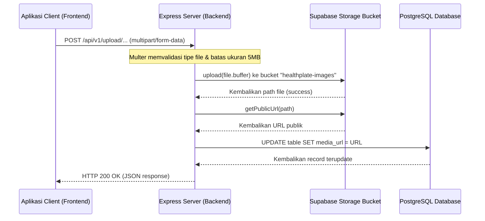
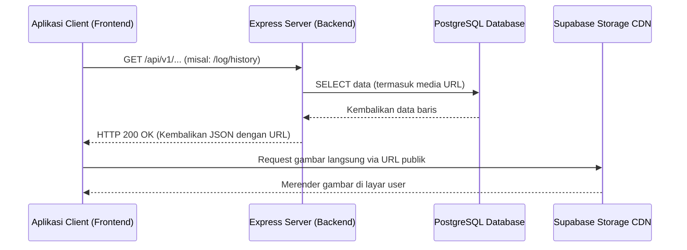

# Media & Storage Readiness Audit — HealthPlate

Laporan ini menyajikan hasil audit terhadap seluruh infrastruktur media, penyimpanan file, endpoint upload, dan pemetaan database untuk aplikasi HealthPlate.

---

## 1. Database Media Mapping

Berikut adalah daftar tabel dan kolom dalam database PostgreSQL (Supabase) yang digunakan untuk menyimpan URL file media/gambar:

| Nama Tabel | Nama Kolom | Tipe Data | Deskripsi / Fungsi | Status Penggunaan Aktif |
| :--- | :--- | :--- | :--- | :--- |
| `users` | `avatar_url` | `text` | Menyimpan URL foto profil pengguna | Terintegrasi penuh dengan upload endpoint |
| `recipes` | `image_url` | `text` | Menyimpan URL foto resep makanan | Terintegrasi untuk resep buatan user |
| `food_products` | `image_url` | `text` | Menyimpan URL gambar produk makanan | Diisi via barcode scan (Open Food Facts) |
| `meal_packages` | `image_url` | `text` | Menyimpan URL cover program paket makan | Diisi via seeder/database manual |
| `log_entries` | `image_url` | `text` | Menyimpan URL foto makanan yang dikonsumsi | Kolom ada, tetapi tidak ada fungsionalitas upload |
| `articles` | `image_url` | `text` | Menyimpan URL gambar sampul artikel | Diisi via seeder/database manual |
| `tips` | `image_url` | `text` | Menyimpan URL gambar infografis tips | Diisi via seeder/database manual |

---

## 2. Supabase Storage Bucket Audit

Berdasarkan pemeriksaan API Storage Supabase, berikut status bucket penyimpanan aktif:

* **Nama Bucket**: `healthplate-images`
* **Tipe Akses**: **Public** (`public: true`)
* **Maksimum Ukuran File**: 5MB (Dibatasi di tingkat backend via middleware Multer).
* **Mime Types**: Dibatasi hanya file dengan ekstensi gambar (`image/*`) via filter multer.
* **Keamanan/RLS**: Karena bucket ini bersifat publik, file di dalamnya dapat dibaca oleh siapa saja tanpa autentikasi menggunakan URL publik yang dihasilkan oleh backend.

---

## 3. Existing Upload Endpoints

Proyek backend saat ini memiliki 2 endpoint untuk mengunggah file media:

### A. POST /api/v1/upload/avatar
* **Fungsi**: Mengunggah foto profil pengguna dan memperbarui `users.avatar_url`.
* **Autentikasi**: Ya (`authMiddleware` aktif).
* **Middleware**: `upload.single('image')` (Multer Memory Storage, batas 5MB, filter tipe file `image/*`).
* **Controller**: `uploadAvatar` pada `src/controllers/upload.controller.js`.
* **Service**: `updateAvatar` pada `src/services/upload.service.js`.
* **Request Body**: Multipart Form-data (`image` file).
* **Response Body (200 OK)**:
```json
{
  "success": true,
  "message": "Avatar berhasil diupdate.",
  "data": {
    "user_id": "uuid",
    "name": "User Name",
    "avatar_url": "https://jopxbgesybjqteziskgl.supabase.co/storage/v1/object/public/healthplate-images/avatars/1718283739-abc.jpg",
    ...
  }
}
```

### B. POST /api/v1/upload/recipe/:id
* **Fungsi**: Mengunggah foto resep makanan dan memperbarui `recipes.image_url`.
* **Autentikasi**: Ya (`authMiddleware` aktif).
* **Middleware**: `upload.single('image')` (Multer Memory Storage, batas 5MB, filter tipe file `image/*`).
* **Controller**: `uploadRecipeImage` pada `src/controllers/upload.controller.js`.
* **Service**: `updateRecipeImage` pada `src/services/upload.service.js`.
* **Constraint**: Hanya mengizinkan pemilik resep (`recipes.user_id = auth.uid()`) yang dapat memperbarui foto.
* **Request Body**: Multipart Form-data (`image` file).
* **Response Body (200 OK)**:
```json
{
  "success": true,
  "message": "Foto resep berhasil diupdate.",
  "data": {
    "recipe_id": "uuid",
    "recipe_name": "Resep Baru",
    "image_url": "https://jopxbgesybjqteziskgl.supabase.co/storage/v1/object/public/healthplate-images/recipes/1718283739-xyz.jpg",
    ...
  }
}
```

---

## 4. Alur Media & Penyimpanan (Data Flows)

### A. Alur Unggah File (Upload Flow)


### B. Alur Pengambilan File (Retrieval Flow)

