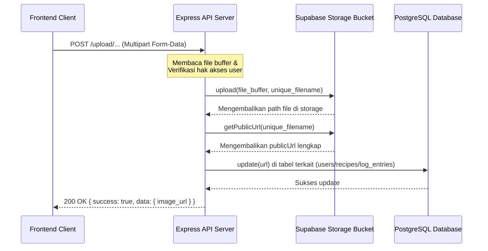

# HealthPlate Storage & Media Upload Documentation

Dokumen ini menjelaskan alur penyimpanan berkas gambar (media upload) ke Supabase Storage, konfigurasi bucket, struktur folder penyimpanan, serta cara pembentukan URL Publik untuk diakses di frontend.

---

## 1. Storage Bucket

Semua file gambar yang diunggah melalui backend HealthPlate disimpan pada layanan **Supabase Storage** di bawah satu bucket utama yang diatur dengan hak akses baca publik:

* **Bucket Name**: `healthplate-images`
* **Access Level**: Public (Dapat diakses langsung melalui URL publik tanpa token otentikasi).

---

## 2. Struktur Direktori & Endpoint Unggah

File yang diunggah dikelompokkan secara teratur ke dalam subdirektori berdasarkan fungsinya untuk memudahkan pengelolaan aset media:

```text
healthplate-images/
├── avatars/        # Gambar avatar profil pengguna
├── recipes/        # Gambar makanan hidangan resep
└── consumption/    # Foto makanan log harian pengguna (food log)
```

---

### A. Avatar Upload
* **Endpoint**: `POST /api/v1/upload/avatar`
* **Otentikasi**: Bearer Token
* **Request Content-Type**: `multipart/form-data`
* **Request Payload**:
  * `image`: File Gambar (Binary)
* **Penyimpanan di Storage**: Disimpan di folder `avatars/` dengan nama file unik:
  `avatars/[timestamp]-[random_string].[ext]`
* **Database Updates**: Memperbarui kolom `avatar_url` pada tabel `users` milik pengguna yang sedang login.

---

### B. Recipe Image Upload
* **Endpoint**: `POST /api/v1/upload/recipe/:id`
* **Otentikasi**: Bearer Token
* **Path Parameters**:
  * `id`: UUID dari resep target.
* **Request Content-Type**: `multipart/form-data`
* **Request Payload**:
  * `image`: File Gambar (Binary)
* **Penyimpanan di Storage**: Disimpan di folder `recipes/` dengan nama file unik:
  `recipes/[timestamp]-[random_string].[ext]`
* **Database Updates**: Memperbarui kolom `image_url` pada tabel `recipes` milik user (resep sistem ditolak).

---

### C. Food Log Image Upload (Consumption Photo)
* **Endpoint**: `POST /api/v1/upload/consumption-photo`
* **Otentikasi**: Bearer Token
* **Request Content-Type**: `multipart/form-data`
* **Request Payload**:
  * `image`: File Gambar (Binary)
  * `entry_id` (di body atau query string): UUID entri log makanan (`log_entries.entry_id`).
* **Penyimpanan di Storage**: Disimpan di folder `consumption/` dengan nama file unik:
  `consumption/[timestamp]-[random_string].[ext]`
* **Database Updates**: Memperbarui kolom `image_url` pada tabel `log_entries` yang sesuai dengan `entry_id` pengguna bersangkutan.

> [!WARNING]
> Skrip pengujian legacy `test_log_image_upload.js` mengirimkan request ke `POST /api/v1/upload/log/:entryId` yang menghasilkan error `404 Route Not Found` di server aktual. Pengembang frontend wajib menggunakan endpoint resmi `POST /api/v1/upload/consumption-photo` dengan menyertakan `entry_id` pada Request Body atau Query String.

---

## 3. Alur Pembentukan URL Publik (Public URL Generation Flow)

Ketika client melakukan unggahan file, backend memproses request melalui alur berikut:



### Format URL Publik:
URL publik dibentuk menggunakan format standar Supabase Storage:
```text
https://[supabase_project_ref].supabase.co/storage/v1/object/public/healthplate-images/[folder]/[filename]
```
Contoh real:
`https://jopxbgesybjqteziskgl.supabase.co/storage/v1/object/public/healthplate-images/consumption/1781340151188-xipah89n2cs.png`
URL ini dapat langsung digunakan pada tag gambar `` di HTML atau widget `Image.network(...)` di Flutter tanpa memerlukan header otentikasi tambahan.
